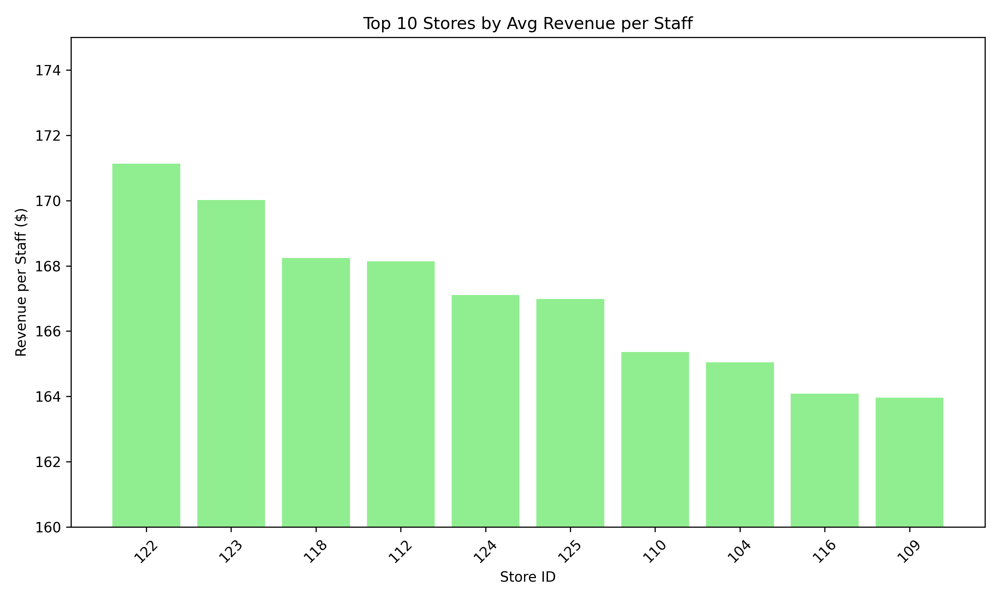

# performance_kpis

This project analyzes staff efficiency across 28 retail stores over a 30-day period using real-world performance metrics. It uses Python and pandas to evaluate hourly performance by calculating KPIs such as Revenue per Staff and Conversion Rate.

## Project Overview

This simulation replicates staffing, customer, and revenue data from 10 AM to 9 PM daily for each store. The goal is to identify peak hours, optimize scheduling, and evaluate labor effectiveness by time and location.

## Key Features

- Generated and analyzed over 9,000 hourly data points across 28 stores
- Calculated Revenue per Staff and Conversion Rate as core KPIs
- Visualized top-performing store hours by revenue
- Cleaned and structured CSV data for reproducible analysis
- Includes Python script to run the full workflow

## Sample Output

The chart below shows the top 10 hourly time blocks across all stores by revenue per staff:

## Files Included

- `retail_staffing_efficiency_june2024_large.csv` – full dataset used in the project
- `store_efficiency_summary.csv` – summary output with daily KPIs by store
- `plot_staff_efficiency.py` – Python script to analyze and plot the data
- `top_10_revenue_per_staff.png` – sample visualization from the analysis

## Business Value

This analysis can be used by district managers, operations leads, or business analysts to identify labor inefficiencies, improve sales performance through smarter scheduling, and compare staffing ROI across locations.

## Automation Plan

The current code can be integrated into a scheduled script to pull data from a POS or workforce platform and update summary outputs daily. Future development could include real time dashboards or predictive models for labor allocation.

## Author

Wyatt Brereton  
[Portfolio Website](https://sites.google.com/u/0/d/18HYom_BAQB-ZSfd2Fe5JN4r762mXC1h3/p/1h2SnzTLgyf2ABZn_vliKrxlGYw9GqMnV/preview)  
[LinkedIn](https://www.linkedin.com/in/wyattbrereton)
